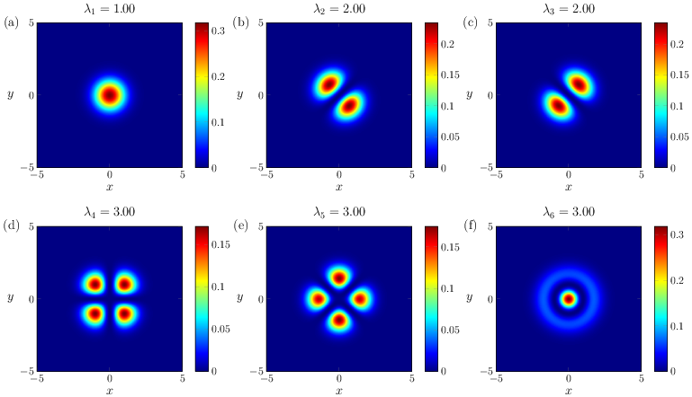
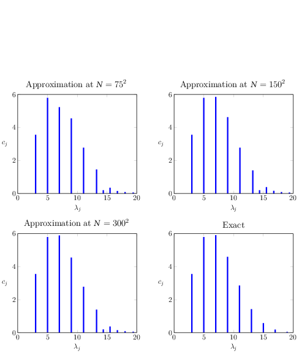

# ConvergenceHermitianDMD

This repository contains the code to reproduce the numerical experiment in the paper
- [On the Convergence of Hermitian Dynamic Mode Decomposition](https://arxiv.org/abs/2401.03192), by N. Boullé and M.C. Colbrook, arXiv:2401.03192, 2024.

The code is written in MATLAB and requires the [Chebfun](https://www.chebfun.org/) library on the MATLAB path.

#### Eigenstates of the 2D Schrodinger operator discovered by Hermitian DMD
 

#### Visualization of the eigenvalues and approximate measures
 